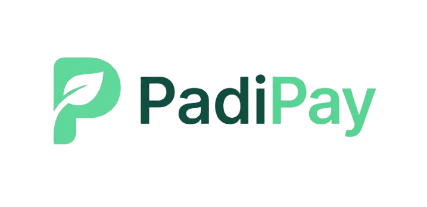
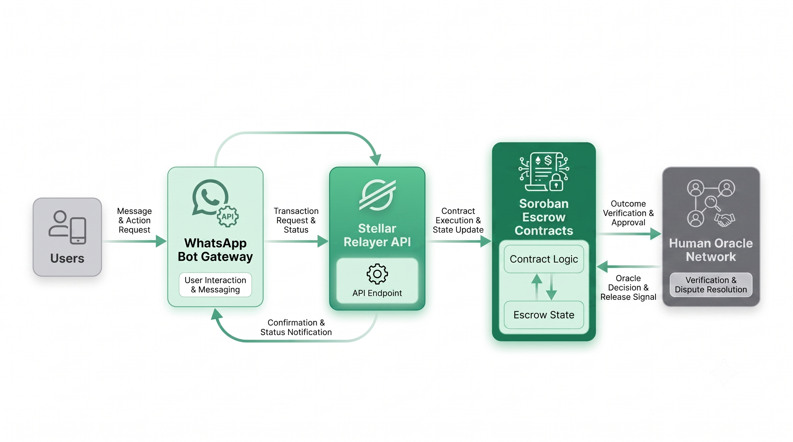

<div align="center">
  

  # PadiPay Frontend
  
  **"Trade with confidence, even with people you've never met."**

  [](https://opensource.org/licenses/MIT)
  [](https://nextjs.org/)
  [](https://soroban.stellar.org/)
</div>

<br />

The **PadiPay Portal** is the public entry point to the PadiPay ecosystem—an MVP-stage, open-source, WhatsApp-powered escrow platform built on Stellar Soroban. This repository serves as the central discovery hub for contributors, users, and ecosystem participants to understand our architecture, access developer resources, and explore the protocol.

## Key Capabilities

- **Frictionless Commerce:** Abstracting blockchain complexity through a simple conversational interface on WhatsApp.
- **Trustless Escrow:** Decentralized, formally verified smart contracts that securely lock funds until mutual agreement.
- **Gasless Transactions:** Sponsored fee-bumping infrastructure ensuring users never have to worry about native tokens or gas fees.
- **Community Dispute Resolution:** A decentralized mediator network designed to handle commerce disputes fairly and transparently.

## High-Level Architecture

PadiPay leverages a modular architecture separating the conversational interface, the relayer infrastructure, and the on-chain settlement layer.



## The Ecosystem

PadiPay is composed of several specialized, open-source repositories. We welcome contributions across the entire stack:

- [**`stellar-relayer-api`**](https://github.com/Padi-Pay/stellar-relayer-api) — High-performance bridge handling gasless transaction relays, fee-bumping, and Soroban event monitoring.
- [**`soroban-escrow-contracts`**](https://github.com/Padi-Pay/contract) — Formally verified Rust contracts responsible for multi-party escrow logic and secure fund holding.
- **`padipay-frontend`** *(This Repository)* — Holds both the landing page/developer discovery hub (`/web`) and the conversational interface (`/whatsappbot`) that abstracts blockchain complexity away from the end user.
- [**`padipay-platform`**](https://github.com/Padi-Pay/padipay-platform) — The meta-repository containing governance documents, architecture diagrams, roadmaps, and ecosystem standards.

## Technology Stack (Portal)

This portal is built for speed, accessibility, and a premium user experience:

- **Framework:** Next.js (App Router)
- **Styling:** Tailwind CSS
- **Animations:** Framer Motion
- **Language:** TypeScript
- **Icons:** Lucide React

## Local Development

To run the PadiPay Portal locally:

1. **Clone the repository:**
   ```bash
   git clone https://github.com/Padi-Pay/padipay-frontend.git
   cd padipay-frontend/web
   ```

2. **Install dependencies:**
   ```bash
   npm install
   # or yarn install / pnpm install
   ```

3. **Start the development server:**
   ```bash
   npm run dev
   ```

4. **View the application:**
   Open [http://localhost:3000](http://localhost:3000) in your browser.

## Contributing

We believe in open commerce. Whether you are a Rust smart contract engineer, a frontend developer, or a community mediator, there is a place for you in the PadiPay ecosystem.

1. Check out the [**`padipay-platform`**](https://github.com/Padi-Pay/padipay-platform) repository for contribution guidelines, open bounties, and our ecosystem roadmap.
2. Fork the relevant repository.
3. Create your feature branch (`git checkout -b feature/AmazingFeature`).
4. Commit your changes (`git commit -m 'feat: Add some AmazingFeature'`).
5. Push to the branch (`git push origin feature/AmazingFeature`).
6. Open a Pull Request.

## License

This project is licensed under the MIT License - see the LICENSE file for details.
