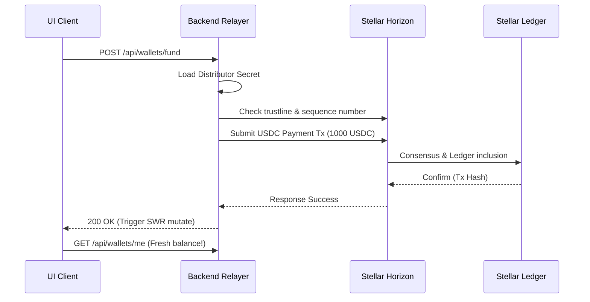

# Stellar Blockchain & USDC Integration Guide

This document serves as the developer integration reference for interacting with the Stellar blockchain network, specifically managing USDC liquidity, trustlines, transaction construction, and utilizing the Stellar Testnet faucet.

---

## 1. Stellar USDC and Asset Trustlines

In Stellar, an account cannot hold balances of any asset other than the native token, Lumens (XLM), unless it explicitly creates a **Trustline** to that asset. The trustline indicates trust in the specific issuing account and specifies a limit.

### USDC Details (Stellar Testnet)
- **Asset Code:** `USDC`
- **Asset Issuer:** `GBBD47IF6LWK7P7TQA6B57ZB2XM3FDPZWMT2LL56M3SBYKVB5RR4YVKJ`
- **Horizon API URL:** `https://horizon-testnet.stellar.org`

### Trustline Lifecycle Flow
When a wallet is first created or imported in the backend:
1. **Account Activation:** The account must be funded with at least 1.5 XLM (base reserve requirements: 1 XLM for account + 0.5 XLM per trustline).
2. **Change Trust Operation:** The user signs a transaction containing a `changeTrust` operation pointing to the USDC asset and issuer.
3. **Receipt confirmation:** Once submitted to Horizon, the account can send, receive, and lock USDC.

---

## 2. Testnet Funding & Stellar Faucet (Friendbot)

To facilitate developer onboarding, the Stellar network provides a faucet called **Friendbot** that funds testnet XLM accounts automatically.

For USDC, PadiPay interfaces with a custom faucet relayer on the backend. When the user requests testnet USDC:
1. The frontend invokes `POST /api/wallets/fund`.
2. The backend relayer receives the request, loads its master testnet distributor account, and constructs a Stellar transaction.
3. The transaction executes a `payment` operation sending `1000 USDC` to the user's public address.
4. Once Horizon confirms the ledger update, the backend returns success to the client, triggering a UI balance refetch.

---

## 3. Withdrawal Mechanics

Move liquidity to an external exchange or custodian wallet:
1. **Destination Checking:** The destination address must be a valid Stellar public key (56 characters, uppercase alphanumeric, starts with `G`).
2. **Amount Limit Checking:** Ensure the withdrawal amount is less than or equal to the current USDC balance, minus transaction fee provisions if paid in USDC.
3. **Backend Relayer Submission:** The frontend calls `POST /api/wallets/withdraw`. The backend builds a `payment` operation from the user's managed escrow key to the destination address.
4. **Submitting to Horizon:** Once signed by the relayer's transaction signer service, it is sent to Horizon.

---

## 4. Stellar Transaction Life Cycle

Every transaction submitted goes through the following states:

1. **Creation:** Builders specify source, sequence number, operations, and fee.
2. **Signing:** Cryptographic signatures are attached to the transaction envelope.
3. **Submission:** Sent via HTTP POST to a Horizon Node.
4. **Validation:** Horizon checks signatures, fees, and sequence numbers.
5. **Consensus:** Validator nodes vote on the transaction set containing this transaction.
6. **Inclusion:** Included in a ledger (typically takes 3 to 5 seconds).
7. **Updates:** Event handlers capture changes via SWR streaming endpoints or rest polls.
