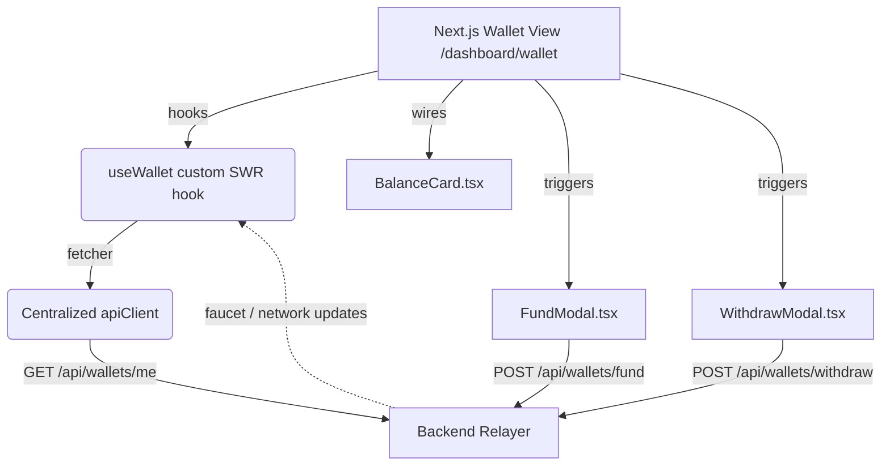

# Embedded Wallet Client Architecture

This document outlines the design, data-fetching paradigm, state synchronization, and component architecture for the Stellar Embedded Wallet interface in PadiPay.

## 1. Architectural Overview

The Wallet Experience epic is built around the concept of a "managed wallet" abstracted for user simplicity. While the underlying ledger executes complex Stellar operations via Horizon nodes and the PadiPay backend Relayer, the frontend coordinates interactions using modern client-side practices:



---

## 2. Caching & Data Fetching (SWR)

To ensure the user's USDC balance is consistently fresh and up to date, we employ **SWR (Stale-While-Rehydrate)** for the primary `GET /api/wallets/me` queries. 

### Why SWR over manual useEffect?
1. **Window Focus Revalidation:** When a user switches browser tabs to check external Stellar anchor transactions or faucet confirmations, returning to the PadiPay portal triggers an automatic update.
2. **Revalidation on Reconnect:** Restores network states gracefully if the connection drops.
3. **Internal Deduplication:** Prevents multiple parent-child components from double-requesting the identical API endpoint concurrently, optimizing traffic overhead.

### Hook Implementation: `hooks/useWallet.ts`
```typescript
export function useWallet() {
  const { data, error, isLoading, mutate } = useSWR<WalletData>(
    '/api/wallets/me',
    fetcher,
    {
      revalidateOnFocus: true,
      revalidateOnReconnect: true,
      dedupingInterval: 2500,
      shouldRetryOnError: false,
    }
  );
  return { wallet: data, isLoading, error, mutate };
}
```

---

## 3. UI Components Design System

All components utilize the core design language. Key UX rules incorporated:

### A. BalanceCard (`components/wallet/BalanceCard.tsx`)
- **Visual Priority:** Elevates the balance via dynamic styling (accent gradient, distinct text size).
- **Graceful Loading:** Displays a pulse-animated mock skeleton structure while requests are outstanding, preventing layout shifts.
- **Manual Control:** Exposes a spin-animated refresh button to force immediate ledger re-polls if desired.

### B. FundModal (`components/wallet/FundModal.tsx`)
- **Simulation Notice:** Outlines testnet limitations clearly using styled info-alert panels, telling the user that it communicates with a faucet.
- **Button Feedback:** Prevents double-clicks. Disables interactions and renders a rotating spinner inside the button during async calls.
- **Immediate Mutate:** Force-triggers local SWR cache mutations on success to ensure the new balance displays without user page refreshes.

### C. WithdrawModal (`components/wallet/WithdrawModal.tsx`)
- **Strict Forms Integration:** Integrates `react-hook-form` and `@hookform/resolvers/zod` with local components.
- **Validation Constraints:**
  - Stellar public key checks: Must start with `G` and equal exactly 56 alphanumeric characters.
  - Amount checks: Must be positive (`> 0`) and less than or equal to the client's current balance, verified dynamically.
- **UX feedback:** Disables action states and triggers a success toast notification once backend requests settle.

---

## 4. Error Tolerances

The network layer resolves failures gracefully:
- **Offline / Server Crashes:** SWR captures API failures cleanly. An error indicator banner is displayed inside `WalletView` if the request fails, giving the user feedback that real-time sync with Stellar nodes is degraded.
- **401 Unauthorized:** Handled by centralized `apiClient` interceptors. If a token expires, user state is cleared and redirected to `/login` gracefully.
